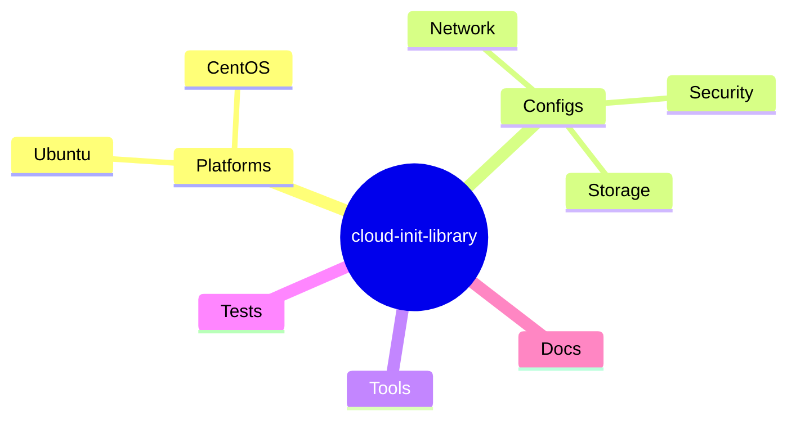
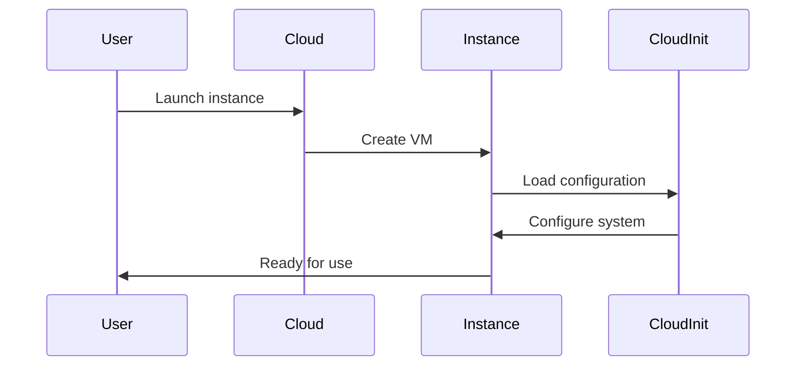

# Cloud Init Library

A comprehensive collection of cloud-init configurations and scripts designed for system administrators and DevOps engineers managing cloud infrastructure at scale.

## Overview

Cloud-init serves as the de-facto standard for initial system configuration across cloud platforms. This repository provides tested, production-ready configurations for:

- System initialization and bootstrapping
- Network configuration and security hardening
- Package management and service deployment
- Infrastructure automation and compliance
- User management and access control


## Configuration Categories

### System Operations

- **Network Management**: VLAN configuration, routing, firewall rules
- **Storage Configuration**: Volume management, mount points, RAID setup
- **Security Hardening**: SELinux/AppArmor, SSH hardening, system auditing
- **Service Deployment**: Container runtime, monitoring agents, backup systems

### Infrastructure Components

The library supports infrastructure-as-code practices across:

- Multi-cloud environments (AWS, Azure, GCP)
- Container orchestration platforms
- CI/CD integration points
- Configuration management systems



## Implementation Workflow

The following diagram illustrates the cloud-init execution flow during instance initialization:



## Quick Start

```yaml
# Example cloud-init configuration
#cloud-config
package_update: true
package_upgrade: true

packages:
  - docker
  - git
  - nginx

runcmd:
  - systemctl start docker
  - systemctl enable docker
```

## Documentation

- [Getting Started Guide](docs/getting-started.md)
- [Configuration Reference](docs/config-reference.md)
- [Best Practices](docs/best-practices.md)
- [Troubleshooting Guide](docs/troubleshooting.md)

## Template Categories

- Base System Configurations
- Security Templates
- Development Environments
- Production Deployments
- Monitoring Solutions
- Backup Configurations

## External Resources

- [Official Cloud-Init Documentation](https://cloudinit.readthedocs.io/)
- [AWS EC2 User Data Guide](https://docs.aws.amazon.com/AWSEC2/latest/UserGuide/user-data.html)
- [Azure Custom Script Extension](https://docs.microsoft.com/azure/virtual-machines/extensions/custom-script-linux)
- [GCP Startup Scripts](https://cloud.google.com/compute/docs/instances/startup-scripts)

## Testing

All configurations are tested using:

- Automated CI/CD pipelines
- Multi-platform validation
- Security scanning tools
- Compliance checkers

## Contributing

See [Contributor Guide](docs/contributor-guide.md) for guidelines on submitting configurations and improvements.

## Support

- Create an [Issue](https://github.com/rbcmgs/cloud-init-library/issues)
- Join our [Discord Community](https://discord.gg/cloudiniters)
- Follow our [Blog](https://medium.com/cloud-init-library)

## Contributors

- [Brandon Cummings](https://github.com/rbcmgs)

## License

[MIT License](LICENSE)
