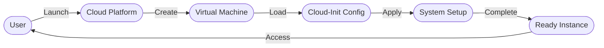

# Cloud Init Library

A comprehensive collection of cloud-init scripts and configurations for system administration and configuration management.

## Overview

Cloud-init is the industry standard for cross-platform cloud instance initialization. It enables automated setup of cloud instances through:

- Early-stage boot configuration
- Package installation
- Network setup
- User/SSH configuration
- Custom script execution

## Features

### Core Capabilities

- **Platform-Specific Configurations**: Ubuntu and CentOS support
- **System Configurations**: Network, storage, security setups
- **Tool Integration**: Automation, monitoring, backup tools
- **Tested Components**: Includes validation suite
- **Documentation**: Comprehensive guides and examples

### Modern Infrastructure Support

- Immutable Infrastructure
- Zero-Touch Provisioning
- Multi-Cloud Compatibility (AWS, Azure, GCP)
- GitOps Integration

## Project Structure

## Workflow

## Quick Start

1. Select your platform directory
2. Choose desired configuration
3. Follow setup documentation

## Contributing

See [Contributor Guide](docs/contributor-guide.md) for guidelines.

## Contributors

- [Brandon Cummings](https://github.com/rbcmgs)

## License

[MIT License](LICENSE)
